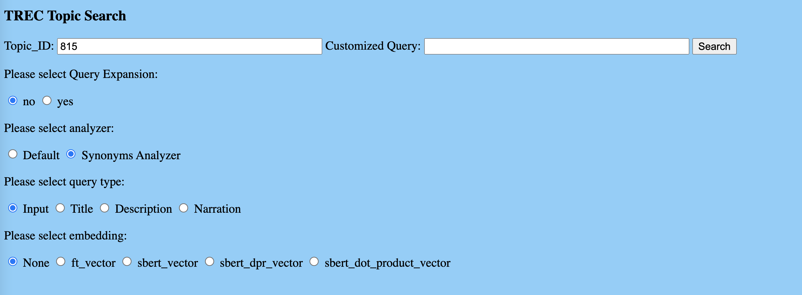
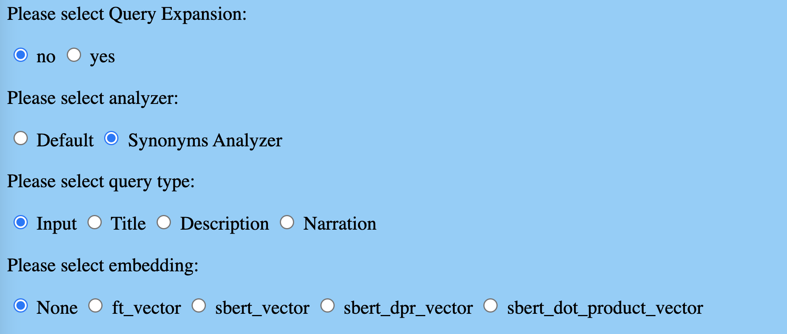
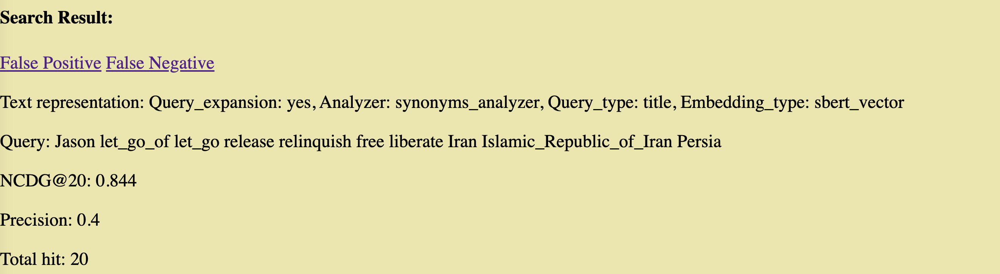
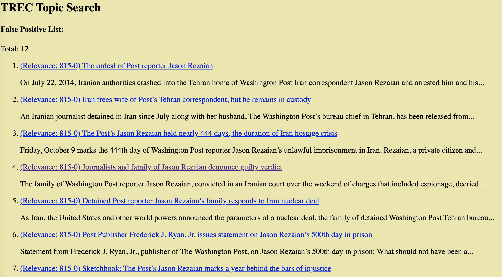
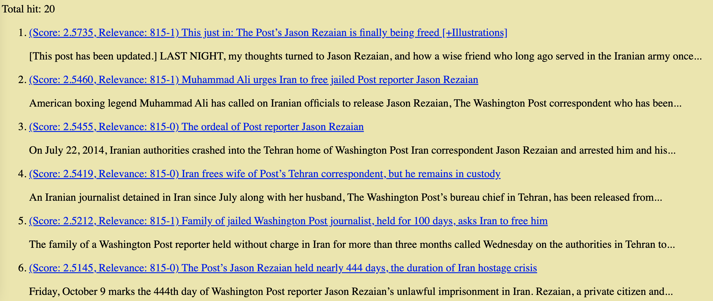

<!-- HEADER -->
<p align="center">
  <h1 align="center">COSI132 Final Project</h1>
  <p align="center">
    Team member: Tongkai Zhang, Shi Qiu, Bowei Sun
    <br>
    Topic TREC #815: Jason Rezaian released from Iran
    <br>
    <a href="https://github.com/Tongkai-Z/132a_project">Github Repo</a>
    <br>
    <a href="#">Presentation Slides</a>
  </p>

<!-- TABLE OF CONTENTS -->
<details open="open">
  <summary>Table of Contents</summary>
  <ol>
    <li>
        <a href="#project-summary">Project Summary</a>
        <ul>
            <li><a href="#intro">Intro</a></li>
            <li><a href="#how-to-run">How to run</a></li>
            <li><a href="#dependencies">Dependencies</a></li>
        </ul>
    </li>
    <li><a href="synonyms-analyzer">Synonyms Analyzer</a></li>
    <li><a href="#query-expansion">Query Expansion</a></li>
    <li><a href="#bert-model-selection">Bert Model Selection</a></li>
    <li><a href="#fine-tune-on-bert">Fine Tune on Bert</a></li>
    <li><a href="#user-interface">User Interface</a></li>
    <li><a href="#">Contributions</a></li>
  </ol>
</details>
<!-- PROJECT SUMMARY -->

# Project Summary:



### Intro

- Our project topic: _#815: Jason Rezaian released from Iran_
- Description: Find documents that discuss Washington Post journalist Jason Rezaian release from Iranian prison.
- Narrative: Relevant documents include those that mention that Washington Post journalist Jason Rezaian had served in an Iranian prison and was released, as well as those that describe efforts from the Washington Post and others to have him released.

We first adopted the metric from HW5 to generate a baseline score on our topics. The baseline socre are shown as below:

<h3>TODO: PUT RESULT TABLE HERE</h3>

To identify the detailed results, we wrote some python script to identify all the false negative and false positive results.

**False Negative**: not retrieved, relevant

**False Positive**: retrieved, irrelevant

```
To improve FP and FN results:
	1.	FP: The documents contains more keywords,  but not highly related to the description retrieved.
    (Trial of Post reporter detained in Iran may be nearing end) Mentions about trails, but about serving and releasing from the prision.
    ( State Department urges Iran to release Washington Post correspondent) mentions the actions from US government, but also not including the effort to release the reporter neigher him serving in prison.

	2.	FN: Some documents that are highly related, not but containing the keywords are not selected.
    ( State Department urges Iran to release Washington Post correspondent) This document is about the effort from US Government, but the word “urges”, “free” is not mentioned in description, thus not selected.

We suspect the reason is that Bert is not as effective as expected. Also there are some terms in FN documents, such as “urges”, “to free” are not considered as relative terms, The possible solution is to apply some synonymous in the analyzer. Also fine tune bert with highly relevant documents would probably improve the effectiveness of Bert.
```

Based on the properties of FP/FN results, we further developed 4 techniques aiming to improve our retrieval results.

1. Apply a synonyms analyzer to generate a new index.
2. Apply Query Expansion
3. Select different pre-trained bert models
4. Fine tune on sbert model from HW5 (msmarcos-distilbert-base-v3)
   The detailed implementation will be discussed in later sections.

### How to run

<span style="color:red"> TODO: Revise how to run code</span>.

```
conda activate cosi132a
# load servers
# load fasttext embeddings that are trained on wiki news. Each embedding has 300 dimensions
python -m embedding_service.server --embedding fasttext  --model pa5_data/wiki-news-300d-1M-subword.vec

# load sentence BERT embeddings that are trained on msmarco. Each embedding has 768 dimensions
python -m embedding_service.server --embedding sbert  --model msmarco-distilbert-base-v3

# load sentence BERT embeddings that are trained on msmarco-roberta-base-ance-fristp
python -m embedding_service.server --embedding sbert_dpr  --model msmarco-roberta-base-ance-fristp

# load sentence BERT embeddings that are trained on facebook-dpr-ctx_encoder-multiset-base
python -m embedding_service.server --embedding sbert_dot_product  --model facebook-dpr-ctx_encoder-multiset-base

# load our own fine tuned model
python -m embedding_service.server --embedding sbert_fine_tune --model sbert_fine_tune

python count.py --index_name wapo_docs_50k --topic_id 815 --query_type narration --vector_name sbert_vector --top_k 20

# Run synonyms analyzer
# Build new index
# add synonym list in synonym.txt
cp ./es_service/synonym.txt $ELASTICSEARCH/elasticsearch-7.10.2/config/analysis/
python load_es_index.py --index_name wapo_docs_50k_synonyms --wapo_path pa5_data/subset_wapo_50k_sbert_ft_filtered.jl
#  Run evaluation based on new index
python count.py --index_name wapo_docs_50k_synonyms --topic_id 815 --query_type description --vector_name sbert_vector --top_k 20 -u

# script
sh evaluation.sh

# Search webapp
python web.py --run
```

### Dependencies

<span style="color:red"> TODO: Add more dependencies list </span>.

- elasticsearch_dsl
- pytorch
- numpy

<!-- Synonyms Analyzer -->

# Synonyms Analyzer

- One problem for our baseline score is that the False Negative Rate is relatively high.
  There are 20 level-2 docs in total, but 19 of them are in FN of top_20 retrieved documents

### Approach

- One of our solution is to apply an synonyms analyzer. And use that analyzer to generate a new index. Our new search is then performed
  on the new index.

The synonyms analyzer maps the unretrieved terms in the FN results list. For example,
"release" is synonyms of "effort， urges to free, released, nearing end", other parties is synonyms of
"Washington Post, Jeff Bezos, National Press Club, U.N. human rights experts".
We generated a new index called _wapo_docs_50k_synonyms_ to test out the effect.

To run the new analyzer, first generate a new index with customized analyzer. Then run evaluation metrics on the new index.

### Results Table

The metrics for synonyms analyzer are listed below:

<span style="color:red"> TODO: update results table</span>.

| Search Parameters | title | description | narration|

| ---------------------------| ------ | ----------- | --------- |
| BM25 + default analyzer | 0.5233 | 0.4353 | 0.6389 |
| BM25 + with synonyms | 0.5026 | 0.6348 | 0.5871 |
| fasttext + default analyzer| 0.4716 | 0.5319 | 0.4120 |
| fasttext + with synonyms | 0.463 | 0.632 | 0.633 |
| sbert + default analyzer | 0.6275 | 0.8779 | 0.6125 |
| sbert + with synonyms | 0.645 | 0.779 | 0.831 |

Based on the results, the NDCG score increased a little on description and narrtives,
and remains in the same range for title.
We concluded that this method has some improvements on our retrieval system.

### Potential problems:

One problem with the synonyms analyzer is that it requires the prior knowledge about description and narratives for each topic.
Since we are manually adding synonyms mappings to the analyzer, we can hardly find a way to generalize the technique to some topics
automatically.

To solve the problem, we looked into the method of query expansion in later experiments.

<!-- QUERY EXPANSION -->

# Query Expansion

### Queries

Possible Methods:

- customize the query
- query expansion
- devide and combine query vectors
- Remove redundant words in narrations and descriptions
- Extract meaningful words, embedding them, Use IDF to filter synonyms

```
Example: “Do college graduates have higher income? Do high-school graduates have higher unemployment?” -> [[college, graduates, high, income], [high-school, graduates, high, unemployment]]
```

As it is analyzed in our baseline searches, the tier-2 relevant document is rarely retrieved by all methods. Based on the content of the tier-2 documents, one observation is that these document contains the exact information we need, but present using other expressions. Thus, query expansion is to broadens the query by introducing additional tokens or phrases. In our project, we use the automatic query expansion model, so that this mechanism can be applied to any queries under any topic.

### Wordnet Synonyms Expansion

Query is expanded based on the synonyms of each term. Basically add the synonyms to the near position of each term.

Different threshold is experimented for the query. Threshold x means for each term there will be at most x synonyms added.

**Example**:
Jason Rezaian released from Iran

Threshold 2:
Jason let_go_of let_go release Iran Islamic_Republic_of_Iran Persia

Threshold 3:
Jason let_go_of let_go release relinquish Iran Islamic_Republic_of_Iran Persia

**Result**

**Threshold 3**:

(ndcg@20score/precision)

| Query Type                     | Title     | Narration  | Description |
| ------------------------------ | --------- | ---------- | ----------- |
| bm25                           | 0.523/0.2 | 0.435/0.15 | 0.64/0.25   |
| bm25 + qe(query expansion)     | 0.787/0.4 | 0.59/0.15  | 0.613/0.25  |
| bm25 + synonyms_analyzer + qe  | 0.584/0.3 | 0.59/0.2   | 0.444/0.15  |
| sbert                          | 0.627/0.2 | 0.878/0.15 | 0.612/0.25  |
| sbert + qe                     | 0.784/0.4 | 0.342/0.15 | 0.428/0.25  |
| sbert + synonyms_analyzer + qe | 0.803/0.3 | 0.375/0.2  | 0.364/0.15  |

**Threshold 5**:

(ndcg@20score/precision)

| Query Type                     | Title     | Narration  | Description |
| ------------------------------ | --------- | ---------- | ----------- |
| bm25                           | 0.523/0.2 | 0.435/0.15 | 0.64/0.25   |
| bm25 + qe(query expansion)     | 0.659/0.3 | 0.468/0.15 | 0.613/0.25  |
| bm25 + synonyms_analyzer + qe  | 0.577/0.3 | 0.367/0.15 | 0.624/0.3   |
| sbert                          | 0.627/0.2 | 0.878/0.15 | 0.612/0.25  |
| sbert + qe                     | 0.578/0.3 | 0.365/0.15 | 0.405/0.25  |
| sbert + synonyms_analyzer + qe | 0.84/0.3  | 0.458/0.15 | 0.454/0.3   |

The result shows that Query Expansion with Wordnet can improve the precision as well as ndcg score for some combination of query type and search type. Combined with the synonyms analyzer we found a relatively optimized pair:

(`sbert + synonyms_analyzer + query_expansion` , `title`),

### Threshold

As is described above, query expansion thresholds can affect the search result quite significantly. Thus, further experiments is carried out on testing different thresholds on (`sbert + synonyms_analyzer + query_expansion` , `title`)

| Query Expansion Threshold | NCDG@20 | Precision |
| ------------------------- | ------- | --------- |
| 3                         | 0.803   | 0.3       |
| 5                         | 0.84    | 0.3       |
| 10                        | 0.924   | 0.25      |
| 15                        | 0.749   | 0.2       |
| 20                        | 0.799   | 0.15      |

The result shows that the threshold ten has the highest NCDG score but with some penalty on precision. Therefore, we choose **threshold 5** in the final setting.

Based on the characteristics of the False Negative docs' content, we can append more synonyms to `synonyms.txt`.

(`sbert + synonyms_analyzer + query_expansion` , `title`) is improve to (0.844, 0.4)

<!-- BERT MODEL SELECTION -->

# Bert model selection

### Embeddings

- Rank directly with Bert embeddings (no BM25)
- creating customized document vectors e.g. doc2vec
  - Removing words before training (tf-idf)
  - Training only on relevant documents vs whole corpus
  - Ranking from vectors directly

<!-- FINE TUNE ON BERT -->

# Fine tune on Bert

### Intro

- Besides selecting different pre-trained models, we also experimented some fine tune method to the default sbert model
  (msmarcos-distilbert-base-v3) from HW5.

- Due to the limitation of computational power in our local machine, we choose to use Google Colab to deploy our code for training
  the bert model. We used the Hugging Face library to access some pre-trained bert models, including the one from HW5.

- Please refer to the code in Jupyter Notebook [here.](https://colab.research.google.com/drive/1idHtwMeycLTqmv7GGgyvvFmk6TOp8O6l?usp=sharing)

### Method

- Preprocessing
  1. First we extracted all documents that are labeled with our topic, including all documents woth annotation "815-0, 815-1, 815-2" in _get_relevant.py_.
  2. We uploaded the formated csv file to my personal google drive [here](https://drive.google.com/file/d/1IDLbVP3im2xIJr2gaB8Fmn4rGrguSU6J/view?usp=sharing)
     in order to later use it in Google Colab.
- Setup for training
  1. Setup GPU and Hugging Face library
  2. Load data from uploaded csv file, which contains the labels (0 as irrelevant, 1 as relevant score of 1 or 2),
     and content and customized content.
  3. Adopt the default model from HW5, which is the msmarcos-distiled-bert-base-v3.
  4. In order to train the model based on our documents, we converted the model output into a two-class classification model.
     Documents with relative score of 1 or 2 are labels as positive, and documents with relative scores of 0 is labeled as 0.
  5. Tokenize the content using bert tokenizer, and convert the list of terms into a vector of integer. We also padded the
     vector with a [CLS] label for class, and a [SEP] label for ending symbol. Finally each content string is converted into a tensor
     vector of integers for training.
  6. Split the training data and test data into ratio of 9:1.
  7. Setup hyperparameters for training loop. We used the following hyperparameters
  - batch size 8
  - Epoch number 4
  - Learning rate 0.05
  - Adam optimizer
  8. Save the model to google drive, and apply the model to ES.

### Problems

- When converting the content into vectors, the default config in bert limited the maximum vector length to 512. However,
  most of content string is longer than 512 tokens. Thus, we truncated the vectors to fit in the length. We are not sure if the
  truncation will affect informative level of the vector.
- Due to the limitation of memory in Google Colab, we have to reduce the batch size to a small number. We are not able to test
  if a larger batch size would give us better training results.
- We cannot find a simple approach to directly train the model just for embedding. Thus we converted the base distilled
  bert model into a classification model.
- After we saved the model, we had problem incorporate it with the current embedding server. Thus we cannot test the actual result
  in our evaluation metrics.

# User Interface

This Flask App is aiming for providing the IR researcher with a friendly interface to observe the result of their searching strategies.

## Input Text


- Topic_ID: topic id is the target id of the topic, it is neccessary for evaluation and query generate based on query type. e.g. title of topic 815
- Customized Query: when query type is selected as 'input', user can input their own query strings. If the topic title, description or narration is used as query, this box can be left blank.

## Options



This search options are based on the experiments we made:

- WordNet Query Expansion
- Synonyms Analyzer
- Query type
- Embedding type

## Search Results

The default behavior of this search engine is returning the top 20 results to the user.

- The **false positive** and **false negative** documents is listed for further improvement.
- The strategy is evaluated by **NCDG@20** and **precision** score, which is also shown at the top of the results list.
- Strategy summary and query string used for search are displayed to user.
- Relevance tag is shown for optimization
- Header



- False Positive Page

  

- Result list

  

# Contribution

Shi Qiu: synonyms analyzer, train fine tuned bert.

Tongkai Zhang: Query Expansion, Merge synonyms analyzer and QE into ES webapp, Developed User Interface
